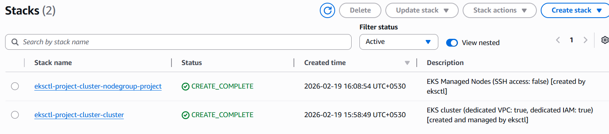
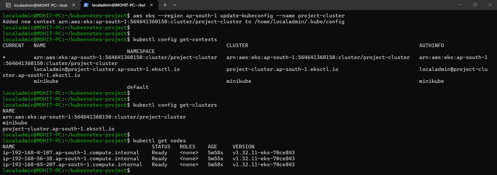
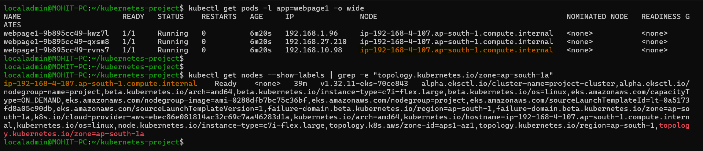
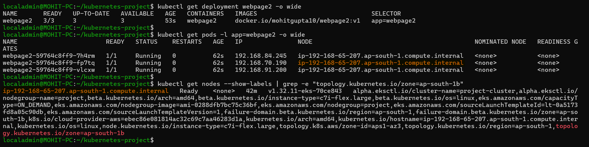
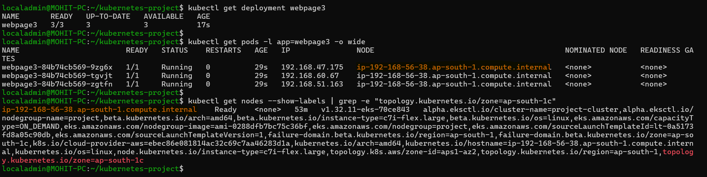
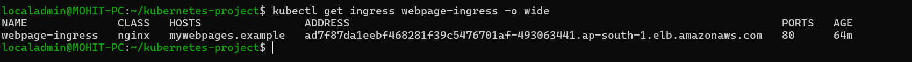
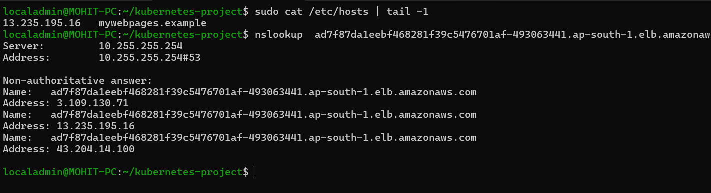
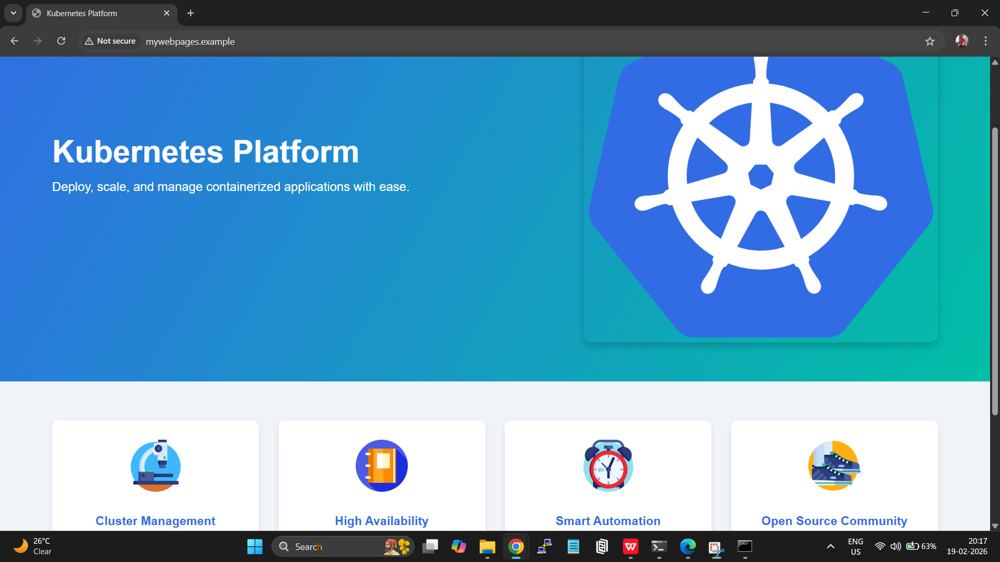
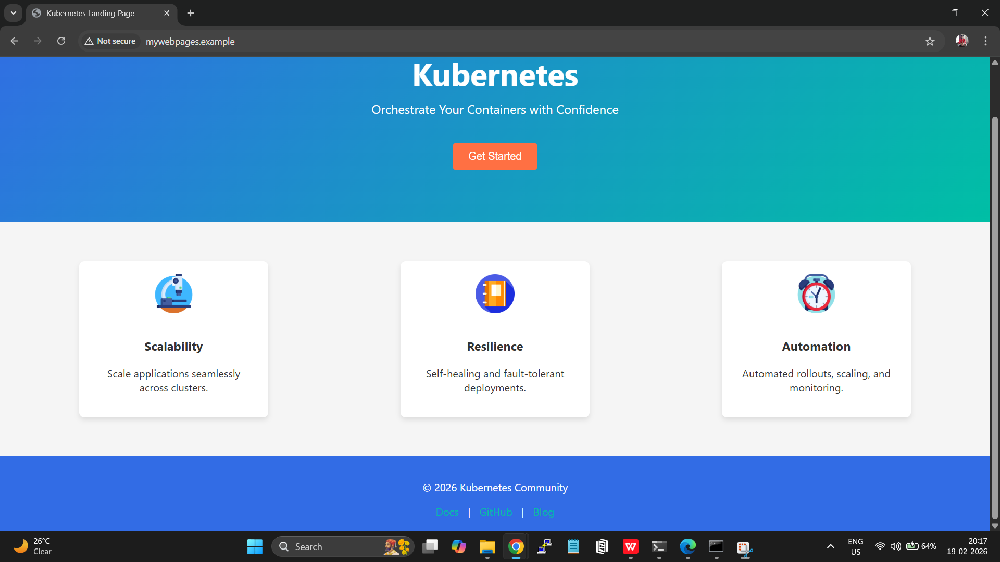
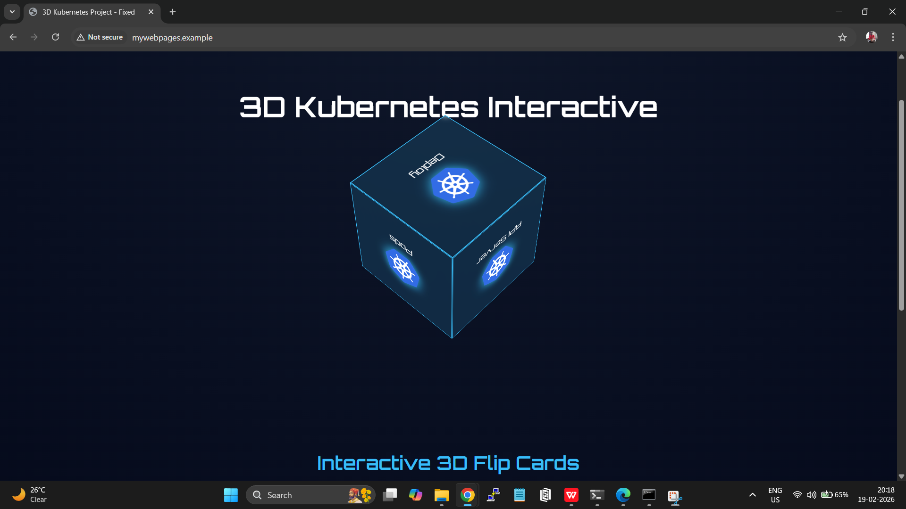

# Microservice Deployment on the aws EKS cluster with ingress and node-selector.

Create a user in the aws IAM with the inline policy attached having EC2FullAccess and generate the access-key and secret-access-key.

Install the aws cli [from here](https://docs.aws.amazon.com/cli/latest/userguide/getting-started-install.html)

Run the command in the wsl and copy paste the access-key and secret-access-key, add the region and output format as per requirement.
```
aws configure
```
------------------------------------------------------------------

## Installation Part

Install minikube [from here](https://minikube.sigs.k8s.io/docs/start/?arch=%2Flinux%2Fx86-64%2Fstable%2Fbinary+download)


Install kubernetes [from here](https://kubernetes.io/docs/tasks/tools/install-kubectl-linux/)

Install eksctl  [from here](https://docs.aws.amazon.com/eks/latest/userguide/install-kubectl.html)

## Application 
Clone the git repository and change directory
```
git clone "https://github.com/MohitGupta1010/Microservice-deployment-aws-eks_cluster-with-ingress-and-node-selector.git" && cd Microservice-deployment-aws-eks_cluster-with-ingress-and-node-selector/
```
Start minikube inside wsl and check status
```
minikube start && minikube status
```
Create a cluster on aws.
```
eksctl create cluster --name project-cluster --region ap-south-1 --nodes 3 --nodes-min 3 --nodes-max 5 --nodegroup-name project --node-type c7i-flex.large --managed
```
Check in aws CloudFormation.

Update the kube-config to point to aws cluster.
```
aws eks --region ap-south-1 update-kubeconfig --name project-cluster
```
Check nodes
```
kubectl get nodes -o wide
``` 


## Before applying yaml file change the nodeSelector value as per region in deploy1.yml, deploy2.yml,deploy3.yml
Execute yaml file
```
kubectl apply -f deploy1.yml &&
kubectl apply -f deploy2.yml &&
kubectl apply -f deploy3.yml &&
kubectl apply -f service.yml
```

#

#

#


## Install the nginx-ingress LB  for aws cluster
```
helm repo add ingress-nginx https://kubernetes.github.io/ingress-nginx && helm repo update &&
helm install nginx-ingress ingress-nginx/ingress-nginx   --namespace kube-system --set controller.service.type=LoadBalancer
```
```
kubectl apply -f ingress.yml
```
Verify ingress service


Get ingress ip from below
```
nslookup <ingress-name>
```
Copy paste the ingress ip  and point it to the domain name in the hosts file of windows.
```
1. run cmd as administrator
2. cd drivers/etc/
3. notepad hosts
4. save
```


## Outputs from windows

----------------------------------

----------------------------------

